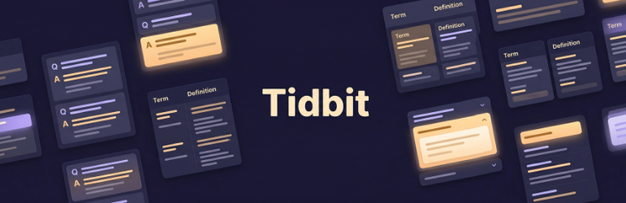

# Tidbits

**Flexible blocks for organizing and displaying bite-sized paired content in WordPress.**

Tidbits gives editors a dedicated space to create short, paired content -- FAQs, glossary terms, quick tips, fun facts -- and display them anywhere on the site using a block with three layout options.

## Features

- **Three display modes** -- Accordion (collapsible), Stacked (vertical list), and Columns (two-column grid) -- selected at the block level and applied consistently to all items
- **Dedicated Tidbit post type** -- Content lives in its own post type, separate from pages and posts, so editors can manage it independently
- **Flavour taxonomy** -- Organize tidbits into categories for easy management in the admin
- **Hand-pick content** -- Search and select individual tidbit posts from a combobox in the editor. No shortcodes, no query blocks, just direct selection
- **Duplicate prevention** -- The editor automatically filters out tidbits already used by sibling blocks, preventing accidental repeats
- **Live editor preview** -- The block editor shows a real preview of each layout mode, including a working accordion toggle
- **Animated accordion** -- Smooth CSS-only expand/collapse animation using `grid-template-rows` with no JavaScript layout thrashing
- **WordPress Interactivity API** -- Accordion state is managed declaratively using the standard WordPress Interactivity API, not custom DOM manipulation
- **Themeable with CSS tokens** -- All visual properties (colors, spacing, font weights, column widths, animation speed) are exposed as CSS custom properties that themes can override
- **Accessible by default** -- Semantic `<dl>` markup, `<button>` triggers, `aria-expanded`, `aria-controls`, `role="region"`, and keyboard-navigable
- **Wide and full-width alignment** -- Supports WordPress block alignment options with proper layout integration

## Requirements

- WordPress 6.6 or later
- PHP 7.0 or later

## Quick Start

1. **Install the plugin** -- Upload to `wp-content/plugins/tidbits` and activate
2. **Create some Tidbits** -- Go to **Tidbits** in the admin sidebar and add posts. Each post is a term (title) and definition (content)
3. **Organize with Flavours** -- Optionally assign Flavour taxonomy terms to group related tidbits
4. **Add the block** -- In the block editor, insert the **Tidbits** block
5. **Pick a layout** -- Choose Accordion, Stacked, or Columns from the block sidebar under Display Settings
6. **Select posts** -- Each Morsel child block lets you search and select a Tidbit post
7. **Add more** -- Click the block appender to add additional Morsel blocks

## Display Modes

**Accordion** -- Each tidbit is a collapsible item with a chevron indicator. Content is hidden by default and expands with a smooth animation on click. Best for FAQs and content where users scan titles before reading.

**Stacked** -- A simple vertical list showing both the term and content. Every item is always visible. Best for glossary terms, definitions, or short reference content.

**Columns** -- A two-column grid with the term on the left and content on the right. Responsive: collapses to a single column on small screens. Best for metadata, specifications, or key-value style content.

## Documentation

Detailed documentation is available in the [`docs/`](docs/) directory:

- [Getting Started](docs/getting-started.md) -- Installation and first steps
- [Blocks](docs/blocks.md) -- Parent and child block architecture
- [Display Modes](docs/display-modes.md) -- Layout options and markup output
- [Custom Post Type](docs/custom-post-type.md) -- Tidbit posts and Flavour taxonomy
- [Theming](docs/theming.md) -- CSS custom properties and theme overrides
- [Interactivity API](docs/interactivity-api.md) -- How the accordion works
- [Accessibility](docs/accessibility.md) -- ARIA attributes and semantic markup
- [Development](docs/development.md) -- Build commands and project structure

## License

GPL-2.0-or-later
